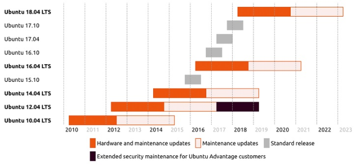

# Support Ubuntu version 16.04

* Proposal: [SDL-NNNN](NNNN-support_ubuntu_16.04.md)
* Author: [Alexander Kutsan](https://github.com/LuxoftAKutsan)
* Status: **Awaiting review**
* Impacted Platforms: [Core]

## Introduction

This proposal is to use actual stable version of Ubuntu - 16.04, instead of Ubuntu 14.04. Terms of hardware support of last one [is already finished](https://wiki.ubuntu.com/Releases?_ga=2.3494576.1830877159.1494597768-585859595.1491489263). 

SDL build system is configured on Ubuntu as the default system for developing and checking functionality.
There is bunch of scripts for preparing clear Ubuntu environment for developing SDL or regression testing.
Current actual stable version is Ubuntu 16.04. It will be supported until 2019Y. 

## Motivation

When an Ubuntu release reaches its “end of life” it receives no further maintenance updates, including critical security upgrades. To prevent any kind of risks, which could be caused by using unsupported Ubuntu version, we highly motivated to start use as default system the new one – 16.04. Also Ubuntu 16.04 is most popular Ubuntu version for desktop now.

## Proposed solution

Freezing Ubuntu 16.04 as default version for SDL would make support and testing much easier, resulting in reduction count of problems that contributors and integrators faced with working with SDL. Also in scope of freezing version of Ubuntu should be identified, described and frozen all dependencies for building SDL like compiler, build system, libc, and 3rd party libraries.

The proposed solution is to use default package versions in Ubuntu 16.04:   
Compiler: 5.3.1   
CMake: 3.5.1   
Make: 4.1

## Potential downsides

Environment and packages version of Ubuntu 14.04 and 16.04 are different. Therefore sometimes issues are reproducible on 14.04 and not reproducible on 16.04 and vice versa.
All checking SDL functionality and integration proceed on 14.04, sometimes there are issues that reproduces only on 16.04 and was not found during regression testing. 

Unification of environment will:
- prevent issues that reproducible on one version and not reproducible on another;
- reduce entry threshold for SDL development and integration.

## Impact on existing code

Some environment scripts should be changed. 
Possible small fixes in some parts of code to avoid warning and errors newer version of compiler.   
Even though new compiler version in the Ubuntu 16.04 allows to use new features from the recent c++11 standard the limitation discussed in scope of [proposal related to C++11](https://github.com/smartdevicelink/sdl_evolution/blob/master/proposals/0043-upgrade-c%2B%2B-standard.md) is still actual.
Thus, there is no impact for the legacy systems based on QNX6.5

## Alternatives considered

The alternative is to use the current version.
